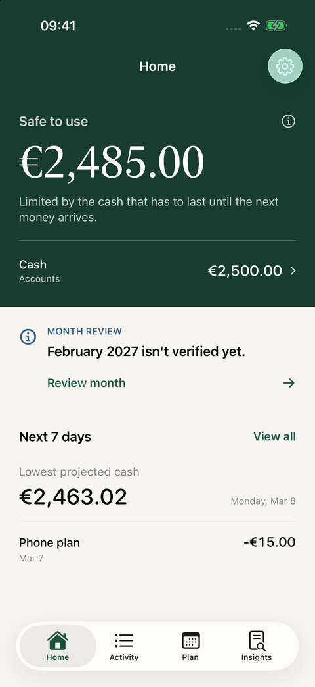
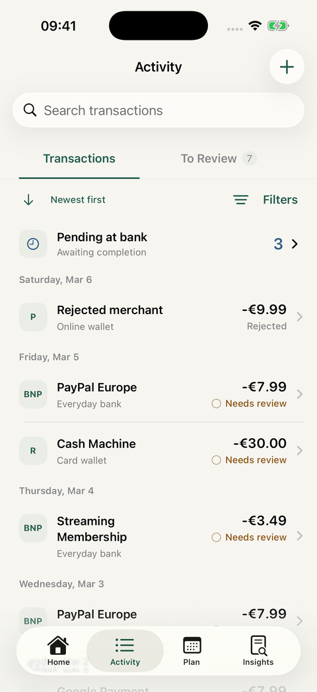
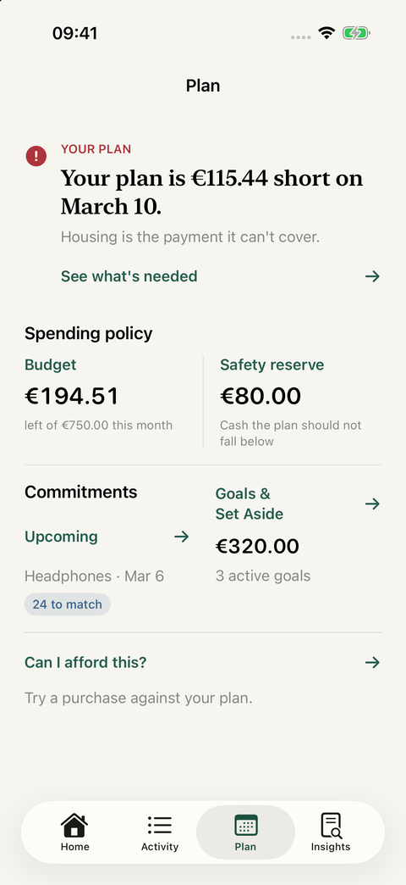

<p align="center">
  
</p>

# FinanceApp

A native, local-first iOS app for understanding available cash, reviewing bank
activity, and planning upcoming payments. Your financial ledger stays on your
device; optional bank sync adds evidence for explicit financial decisions.

**iOS 18+ · SwiftUI · SwiftData · Pure Swift accounting core**

[Get started](#get-started) · [App preview](#app-preview) · [Architecture](docs/architecture.md) · [Contributing](CONTRIBUTING.md) · [CI status](https://github.com/AnasAEA/finance-app/actions/workflows/ci.yml)

## App preview

<table>
  <tr><th>Home</th><th>Activity</th><th>Plan</th></tr>
  <tr>
    <td></td>
    <td></td>
    <td></td>
  </tr>
</table>

*Simulator captures with synthetic data. Each screen illustrates an independent
demo scenario; no personal financial records are shown.*

## What the app does

| Area | Capabilities |
| --- | --- |
| **Home** | Available cash, safe-to-use headroom, upcoming payments, and funding risks. |
| **Activity** | Recorded transactions and synced bank history, distinct pending states, search, sort, and focused filters. |
| **Review** | Quick categorization, cautious existing-payment matching, and merchant rules you explicitly approve. |
| **Plan** | Budgets and spending progress, commitments, debts, installments, goals, and affordability previews. |
| **Bank sync** | Device pairing, explicit account mapping, incremental evidence imports, freshness, and Sync Now status. |
| **Data** | Local persistence, validated FinanceDocument backup and restore, and preserved historical evidence. |

Manual entry and planning work offline. Sync requires a separately configured
[bank service](https://github.com/AnasAEA/finance-bank-sync-poc).

## Financial decisions stay explicit

- Bank movements and account balances are evidence. They become ledger spending
  or income through a confirmation or an explicitly approved rule.
- Automatic handling requires both approved merchant rules and the automation
  master switch. Possible duplicates and unsafe cases require review.
- Account transfers do not become spending. Ownership is separate from custody.
- Currencies retain their own exact amounts. Foreign-currency categorization
  asks for the account-currency charge when needed; no exchange rate is invented.
- Missing evidence means unknown. Showing a bank row never fabricates an
  economic transaction, and resemblance alone never establishes identity.

The app embeds no provider credentials or administrative bank token and has no
analytics. Device pairing uses signed requests. See [data and sync](docs/data-and-sync.md)
for configuration, review boundaries, and backup behavior.

## Get started

Use macOS with Xcode and an installed iOS simulator. The current development
baseline is **Xcode 27.0 / Swift 6.4**; the app targets iOS 18 and later.

```sh
git clone git@github.com:AnasAEA/finance-app.git
cd finance-app
open FinanceApp.xcodeproj
```

Select the **FinanceApp** scheme and an iPhone simulator, then run. This is a
private development repository; cloning requires access. A normal first launch
starts with an empty document. Bank sync is optional and ships with a placeholder
endpoint.

For a synthetic preview, add these Debug scheme launch arguments:

```text
-HCIPrototype -HCIPrototypeVariant full -startTab activity
```

Preview mode uses an in-memory store. See [development setup](docs/development.md)
for test commands, simulator selection, signing, and screenshot reproduction.

## Architecture at a glance

```text
SwiftUI → FinanceProviding / FinanceAppSnapshot → FinanceStore
                                                   │
                                              DomainMapper
                                                   │
                                      SwiftData ⇄ FinanceDocument
                                                   │
                                               FinanceCore
```

**FinanceCore** is the authoritative Foundation-only Swift package for money,
ownership, accounting, reconciliation, and forecasting. UI views consume app
facade types; they do not import FinanceCore or SwiftData.

| Location | Responsibility |
| --- | --- |
| [`FinanceApp/`](FinanceApp/) | SwiftUI screens, facade, local persistence, and signed bank client. |
| [`Packages/FinanceCore/`](Packages/FinanceCore/) | Pure financial domain and forecast engine, independently testable. |
| [`FinanceAppTests/`](FinanceAppTests/) | App, mapping, persistence, and integration coverage. |
| [`FinanceAppUITests/`](FinanceAppUITests/) | Simulator flows and interface acceptance. |
| [`Scripts/`](Scripts/) | Repeatable builds, tests, repository safety, and Release privacy gates. |

## Engineering guide

| Read this | For |
| --- | --- |
| [Development setup](docs/development.md) | Running, testing, and reproducing synthetic previews. |
| [Architecture](docs/architecture.md) | Domain boundaries, persistence contracts, dates, currencies, and history. |
| [Data and sync](docs/data-and-sync.md) | Bank evidence, backup and restore, and local endpoint configuration. |
| [Design decisions](docs/design/README.md) | Activity, categorization, matching, and visual acceptance rationale. |
| [GitHub workflow](docs/github-workflow.md) | Required checks, protected main, and publishing verified changes. |
| [Repository review](docs/repository-review.md) | Presentation audit, completed improvements, and next priorities. |

Private financial data, device captures, and local service settings stay outside
Git. Contributions use a feature-branch pull request and must pass all required
checks before merging. Start with [CONTRIBUTING.md](CONTRIBUTING.md).
